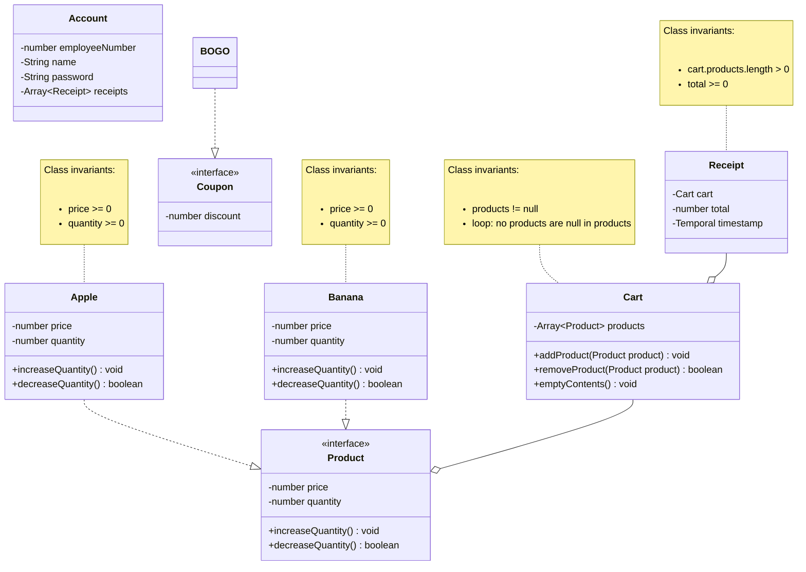

# Changes

* I added increaseQuantity and decreaseQuantity methods to the products
* I added price and quantity variables to the Product interface
* I changed an invariant property for the Receipt class from cart != null to
  cart.products.length > 0
* I added an emptyContents method to the Cart class

# Domain model

