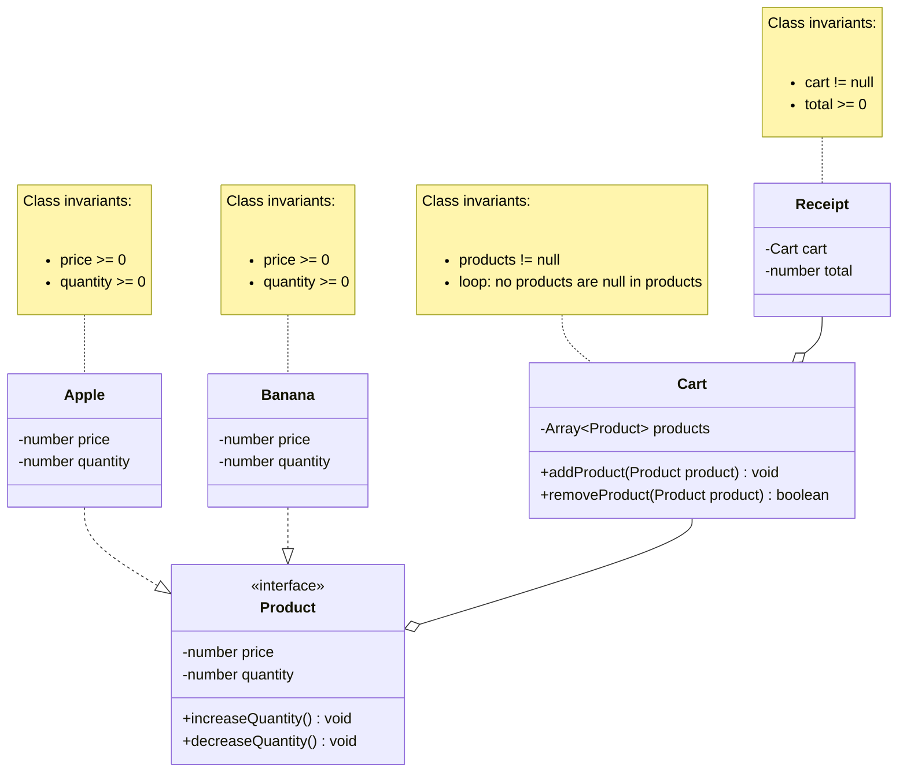

# Domain model

```mermaid
classDiagram
  class Product {
    <<interface>>
    -number price
    -number quantity

    +increaseQuantity() void
    +decreaseQuantity() void
  }

  class Apple {
    -number price
    -number quantity
  }
  Apple ..|> Product

  note for Apple "Class invariants:  <ul>
    <li> price >= 0
    <li> quantity >= 0
    </ul>"

  class Banana {
    -number price
    -number quantity
  }
  Banana ..|> Product

  note for Banana "Class invariants:  <ul>
    <li> price >= 0
    <li> quantity >= 0
    </ul>"

  class Cart {
    -Array~Product~ products

    +addProduct(Product product) void
    +removeProduct(Product product) boolean
  }
  Cart --o Product

  note for Cart "Class invariants:  <ul>
    <li> products != null
    <li> loop: no products are null in products
    </ul>"

  class Receipt {
    -Cart cart
    -number total
  }
  Receipt --o Cart

  note for Receipt "Class invariants:  <ul>
    <li> cart != null
    <li> total >= 0
    </ul>"
```