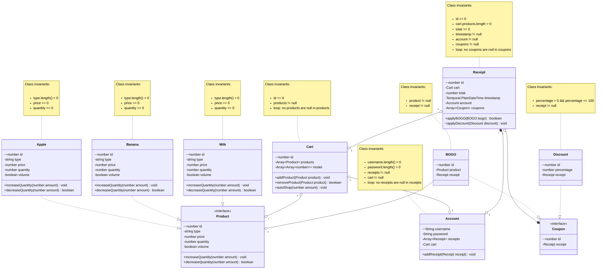

# Domain model

# Changes since phase 3 design
* I added a static variable model to the Cart class to represent the Markov model.
* I added an autoShop method to the Cart class.

# Changes since phase 2
* I added a type attribute to the Product classes for the inventory.

# Changes since phase 2 design
* I added ids to the Product classes and to the Coupon classes to identify them in the database.
* I added an amount parameter to the Product increaseQuantity and decreaseQuantity methods.
* I removed the emptyContents method from Cart since I did not use it anymore.
* I added a cart to Account to be able to persist.
* I removed the cart property from the Product classes.
* I added an addReceipt method to the Account class.
* I changed the addCoupon method in the Receipt class to an applyBOGO and a applyDiscount method.

# Changes since phase 1

* I added an Account class to represent cashiers.
* A added a Coupon interface and 2 children: Discount for coupons that apply to the entire purchase and BOGO for a buy-one-get-one coupon.
* I added a timestamp, an account and a list of coupons to the Receipt class as well as method to add a coupon.
* I added a Milk class, which is a third Product. Milk is measured in volumed instead of physical instances, so I added a boolean to the product classes to indicate if they are measured in volume or physical instances.
* I also added a Cart property to the Product classes and a Receipt property to the Cart class to have a bidirectional relationship.
* I added bidirectional relationships to the diagram and indicated the cardinality.
* I added an id property to the Cart and the Receipt class to have a way to reference them.