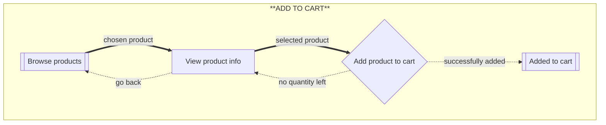
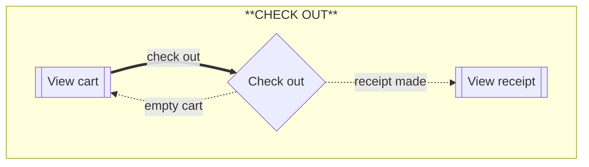
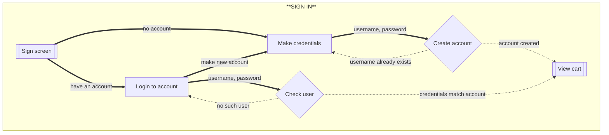
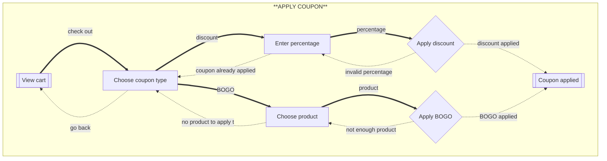

# Flows of interaction

# Flows of interaction for phase 1
## Add to cart

```mermaid
flowchart
  subgraph **ADD TO CART**
    browse[[Browse products]]
    view[View product info]
    add{Add product to cart}
    added[[Added to cart]]
    browse ==chosen product==> view
    view ==selected product==> add
    view -.go back.-> browse
    add -.successfully added.-> added
    add -.no quantity left.-> view
  end
```

## Check out

```mermaid
flowchart
  subgraph **CHECK OUT**
    cart[[View cart]]
    checkOut{Check out}
    receipt[[View receipt]]
    cart ==check out==> checkOut
    checkOut -.receipt made.-> receipt
    checkOut -.empty cart.-> cart
  end
```

# Flows of interaction for phase 2
## Sign in

```mermaid
flowchart
  subgraph **SIGN IN**
    signIn[[Sign screen]]
    credentials[Make credentials]
    createAccount{Create account}
    login[Login to account]
    checkUser{Check user}
    cart[[View cart]]

    signIn ==no account==> credentials
    credentials ==username, password==> createAccount
    createAccount -.username already exists.-> credentials
    createAccount -.account created.-> cart

    signIn ==have an account==> login
    login ==make new account==> credentials
    login ==username, password==> checkUser
    checkUser -.no such user.-> login
    checkUser -.credentials match account.-> cart
  end
```

## Apply coupon

```mermaid
flowchart
  subgraph **APPLY COUPON**
    cart[[View cart]]
    type[Choose coupon type]
    percentage[Enter percentage]
    product[Choose product]
    discount{Apply discount}
    bogo{Apply BOGO}
    applied[[Coupon applied]]

    cart ==check out==> type
    type -.go back.-> cart

    type ==discount==> percentage
    percentage -.coupon already applied.-> type
    percentage ==percentage==> discount
    discount -.invalid percentage.-> percentage
    discount -.discount applied.-> applied

    type ==BOGO==> product
    product -.no product to apply to.-> type
    product ==product==> bogo
    bogo -.not enough product.-> product
    bogo -.BOGO applied.-> applied
  end
```