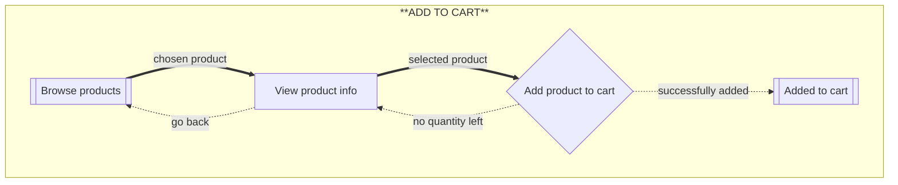
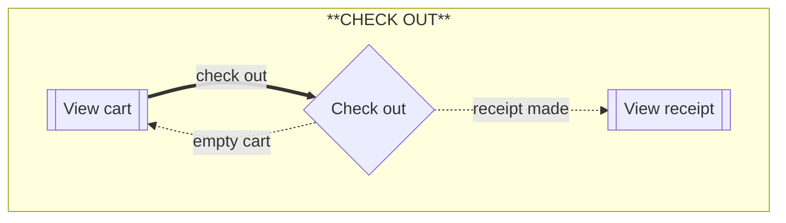

# Flows of interaction

## Add to cart

```mermaid
flowchart
  subgraph **ADD TO CART**
    browse[[Browse products]]
    view[View product info]
    add{Add product to cart}
    added[[Added to cart]]
    browse ==chosen product==> view
    view ==selected product==> add
    view -.go back.-> browse
    add -.successfully added.-> added
    add -.no quantity left.-> view
  end
```

## Check out

```mermaid
flowchart
  subgraph **CHECK OUT**
    cart[[View cart]]
    checkOut{Check out}
    receipt[[View receipt]]
    cart ==check out==> checkOut
    checkOut -.receipt made.-> receipt
    checkOut -.empty cart.-> cart
  end
```