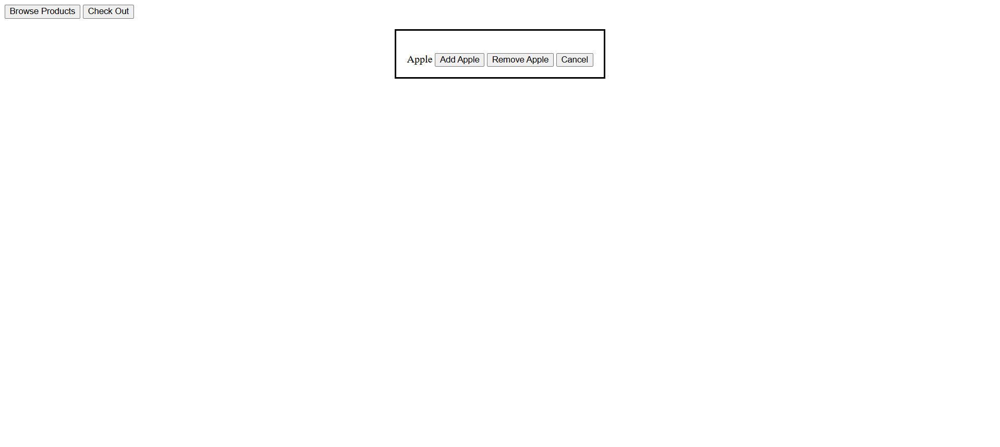
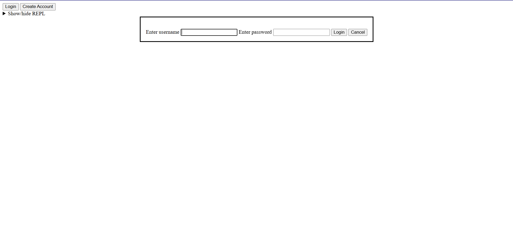
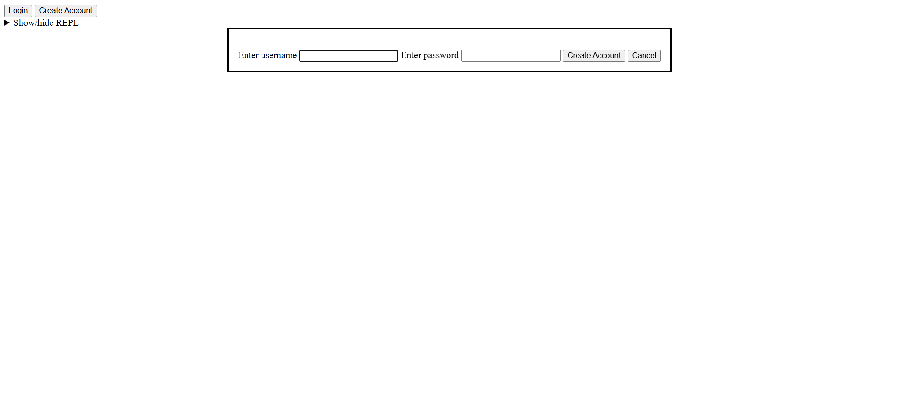
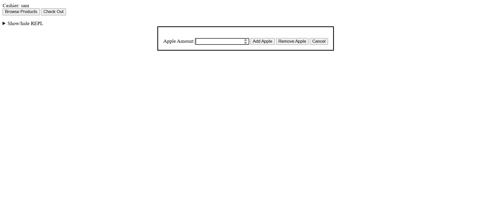
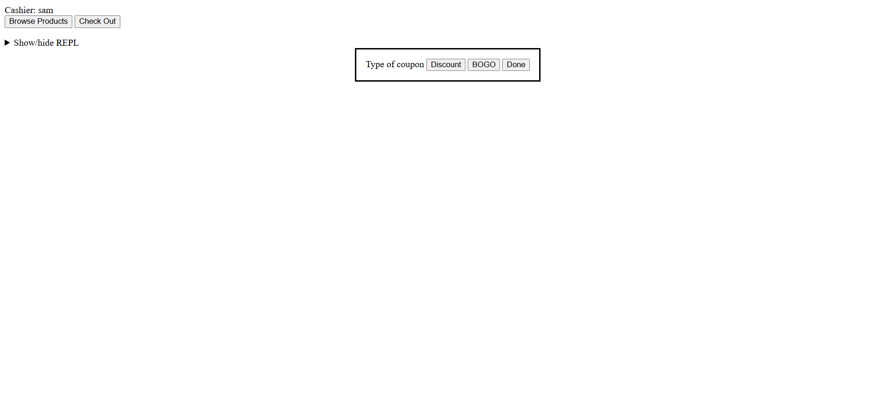
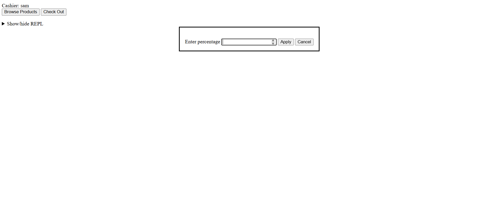
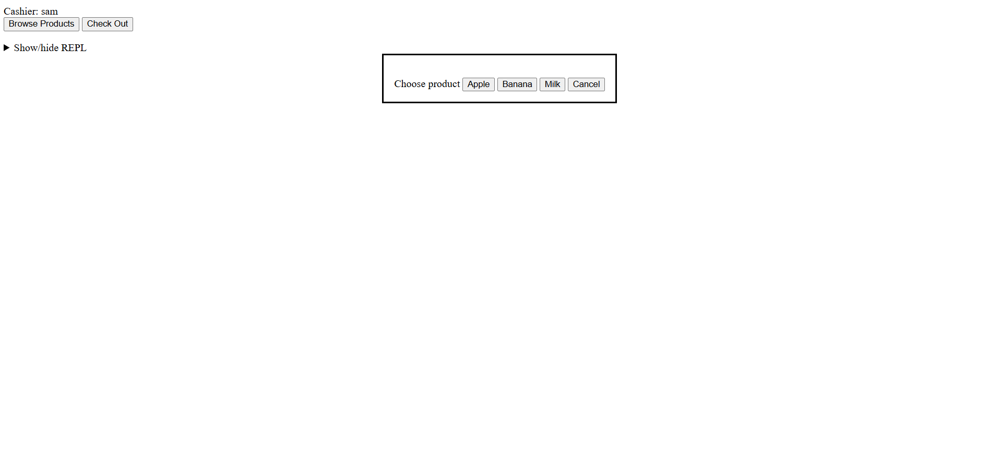

# Phase 1

Here's my cart UI for phase 1:

Here's my add product UI for phase 1:

## Phase 1 visibility

My phase 1 visibiltity was pretty good:

* :+1: The two tasks available to the user are visible on the main screen (the cart).
* :+1: Adding or removing products from the cart is easy to make visible.
* :+1: Checking out is still visible even when it is not available to click.
* :-1: The cart should have a label to represent it's state.

## Phase 1 feedback

My phase 1 implementation of this UI had great feedback:

* :+1: Feedback is given in the form of an error message when the user attempts 
  to check out without any products in the cart. ("Invalid cart size, cart must 
  have at least one product (e.g., Apple).")
* :+1: Feedback is given in the form of an error message when the user attempts
  to remove a product with a quantity of 0. ("Cannot remove a product with a 
  quantity of 0.")
* :+1: When a product is added or removed, it is immediately reflected in the 
  cart, giving the user feedback that their action worked.
* :+1: When a user chooses to check out, they are given feedback by the receipt
  window popping up.

## Phase 1 consistency

My initial implementation of this UI had alright consistency:

* :+1: Adding and removing both products follows the same flow.
* :+1: Buttons are used for every action and input.
* :-1: Not all buttons are labeled with verbs.

# Phase 2 

Here are the login and create account UI for phase 2:

Here's the cart UI as I submitted it for phase 2:

Here's my add product UI for phase 2:

Here's my coupon UI for phase 2:

## Changes from phase 1

* The program starts on the sign in screen now.
* Input boxes are now used to type the quantity of products to add.
* There are screens to add coupons after hitting check out.

## Phase 2 visibility

My phase 2 visibility was good:

* :+1: All available actions for coupons were visible when checking out.
* :+1: Most windows have a label to indicate the state.
* :+1: The windows with input boxes, such as the create account screen, had the
* button visible to enter the input even before typing anything, but displayed
* an error if clicked before typing any input.

## Phase 2 feedback

My phase 2 feedback was fairly good, but could still use some improvements:

* :+1: I gave appropriate feedback in the form of an error message when a user 
  tried to create an account with a duplicate username or with an empty username
  or password. (Username already exists. Please choose a different one.)
  (Username must be at least one character, e.g. sam)
* :+1: I gave appropriate feedback in the form of an error message when a user 
  tried to login with a wrong username or password. (No account with this 
  username and password exist. Please try entering again.)
* :+1: I gave appropriate feedback in the form of an error message when a user 
  tried to add a discount coupon with a negative or decimal percentage. (Invalid 
  percentage. Percentage must be between 0 and 100 (e.g., 10).)
* :+1: I gave appropriate feedback in the form of an error message when a user 
  tried to add a BOGO coupon with a product that had a quantity less than 2. 
  (Not enough milk in cart for a BOGO. Please apply BOGO to a product with a 
  quantity of 2 or more, e.g. 3.)
* :+1: The name of the cashier is visible in the cart view, so the user knows
  they signed into the correct account.
* :-1: Creating an account or logging in sometimes takes a long time, but 
  doesn't show any feedback to indicate something is happening.
* :-1: After adding a coupon there is not any indication that it was properly 
  added.

## Phase 2 consistency

My phase 2 consistency was adequate:

* :+1: Input boxes all looked the same and were all labeled.
* :+1: The flows for applying both coupons are very similar.
* :+1: Buttons were all labeled with text.
* :-1: Some of my buttons were labeled with nouns instead of verbs.
